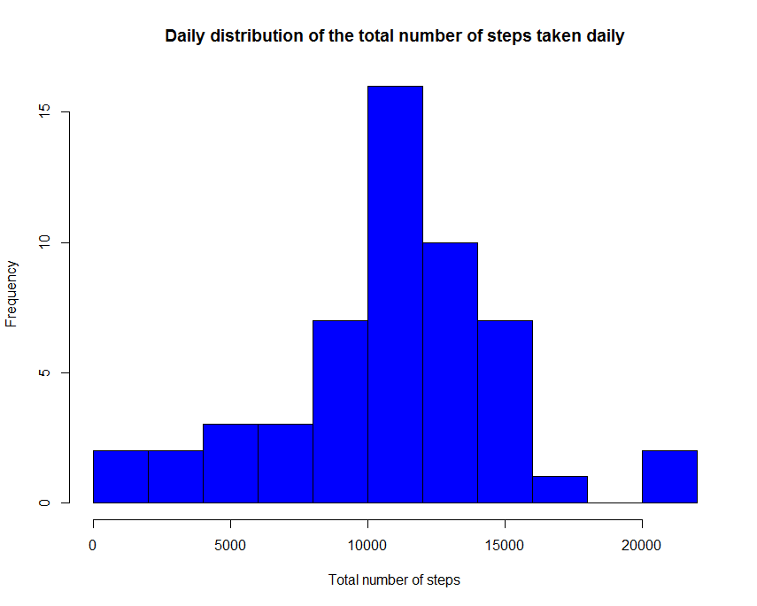
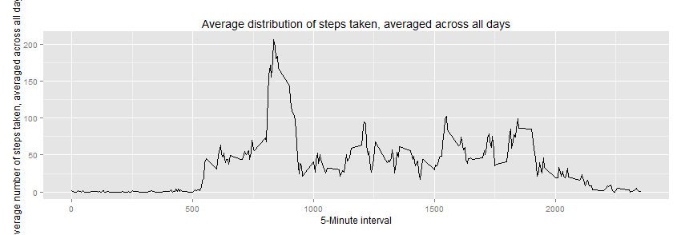
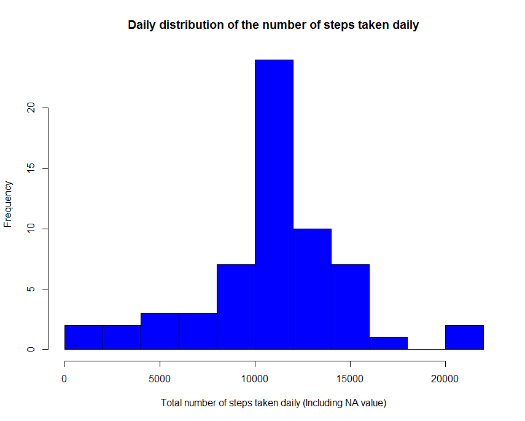

# Reproducible Research Peer Assessment 1 

## Loading and preprocessing the data

Download, unzip, read and convert to required data

```r
if (!file.exists("data.zip")) {
        download.file(url="https://d396qusza40orc.cloudfront.net/repdata%2Fdata%2Factivity.zip",
                      destfile="data.zip")
        unzip("data.zip")
}

# Read data from csv file
data <- read.csv("activity.csv")

# Convert date to date data type
data$date <- as.Date(data$date)
```

## What is mean total number of steps taken per day?

```r
# Remove NA values
data_remove_na <- na.omit(data) 

# Aggregate the total numbers of steps
total_daily_steps <- rowsum(data_remove_na$steps, format(data_remove_na$date, '%Y-%m-%d')) 
total_daily_steps <- data.frame(total_daily_steps) 
names(total_daily_steps) <- ("steps")

# Plot histogram
hist(total_daily_steps$steps, col="blue", breaks=10, main="Daily distribution of the total number of steps taken daily", xlab="Total number of steps")
````


```r
# Compute the mean of the total numbers of steps taken daily
mean(daily.steps$steps)

# Compute the median of the total numbers of steps taken daily
median(daily.steps$steps)
```
- The mean of total number of steps taken daily is 10766
- The median of total number of steps taken daily is 10765

## What is the average daily activity pattern?

```r
# Calculate average steps for each of 5-minute interval during a 24-hour period
library(plyr)
mean_steps <- ddply(data_remove_na,~interval, summarise, mean=mean(steps))

# Plot time series plot of the 5-minute interval and the average number of steps taken, averaged across all days
library(ggplot2)
qplot(x=interval, y=mean, data = mean_steps,  geom = "line",
      xlab="5-Minute interval",
      ylab="Average number of steps taken, averaged across all days ",
      main="Average distribution of steps taken, averaged across all days"
)
````



```r
# Report the 5-min interval, on average across all the days in the dataset, contains the maximum number of steps
mean_steps[which.max(mean_steps$mean), ]
```
- The 5-minute interval, on average across all days, that contains the maximum number of steps is 835

## Imputing missing values

```r
# Calculate and report the total number of NA values in the dataset
library(sqldf)
NA_values <- sqldf(' 
    SELECT d.*            
    FROM "data" as d
    WHERE d.steps IS NULL 
    ORDER BY d.date, d.interval ')

# Return the total number of NA values in the dataset
nrow(NA_values)
```
- The total number of NA values in the dataset is 2304

```r
# Strategy for filling in all of the missing values in the dataset
value1 <- sqldf('  
    SELECT d.*, i.mean
    FROM "mean_steps" as i
            JOIN "data" as d
            ON d.interval = i.interval 
            ORDER BY d.date, d.interval ') 

value1$steps[is.na(value1$steps)] <- value1$mean[is.na(value1$steps)]

value1_total_steps <- as.integer( sqldf(' 
    SELECT sum(steps)  
    FROM value1') );

value1_total_steps_by_date <- sqldf(' 
    SELECT date, sum(steps) as "value1_total_steps_by_date" 
    FROM value1 GROUP BY date 
    ORDER BY date') 

daily_61_steps <- sqldf('   
    SELECT date, value1_total_steps_by_date as "steps"
    FROM "value1_total_steps_by_date"
    ORDER BY date')

# Plot histogram of the total number of steps taken each day
hist(daily_61_steps$steps, 
     main="Daily distribution of the number of steps taken daily",
     breaks=10, col="blue", 
     xlab="Total number of steps taken daily (Including NA value)")
```


```r
# Compute the mean of the total numbers of steps taken daily (Including NA values)
mean(value1_total_steps/NROW(value1_total_steps_by_date))

# Compute the median of the total numbers of steps taken daily (Including NA values)
median(value1_total_steps_by_date$value1_total_steps_by_date)
```
- The mean of total number steps per day is 10766
- The median of total number steps per day is 10766

Observations:

- Do these values (mean and median) differ from the estimates from the first part of the assignment? No. The estimates are quite similar.

- What is the impact of imputing missing data on the estimates of the total daily number of steps? The shape of the histogram remains the same as the histogram from removed NA values. However, the frequency counts increased as expected. In this case, it seems that the data imputation strategy should work for the downstream data analysis and modeling.

## Are there differences in activity patterns between weekdays and weekends?

```r
# Create a factor variable weektime with two levels (weekday, weekend)
value1$weektime <- as.factor(ifelse(weekdays(value1$date) %in% c("Saturday","Sunday"),"weekend", "weekday"))

value2 <- sqldf('   
    SELECT interval, avg(steps) as "mean.steps", weektime
    FROM value1
    GROUP BY weektime, interval
    ORDER BY interval ')

# Make a panel plot containing a time series plot of the 5-minute interval and the average number of steps taken, averaged across all weekday days or weekend days
library("lattice")
plot <- xyplot(mean.steps ~ interval | factor(weektime), data=value2, 
            type = 'l',
            main="Activity patterns on weekday days and weekend days",
            xlab="5-Minute interval",
            ylab="Average number of steps taken")
print (plot)
```


Observations:
- Are there differences in activity patterns between weekdays and weekends? Yes. The plot indicates that the person moves around more (or more active) during the weekend days.
